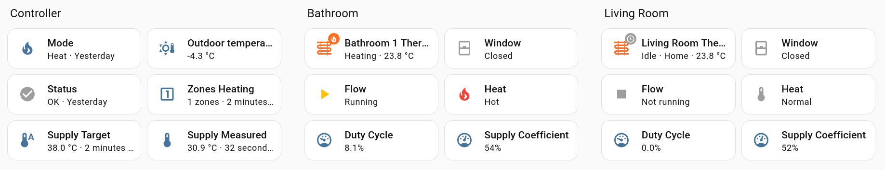
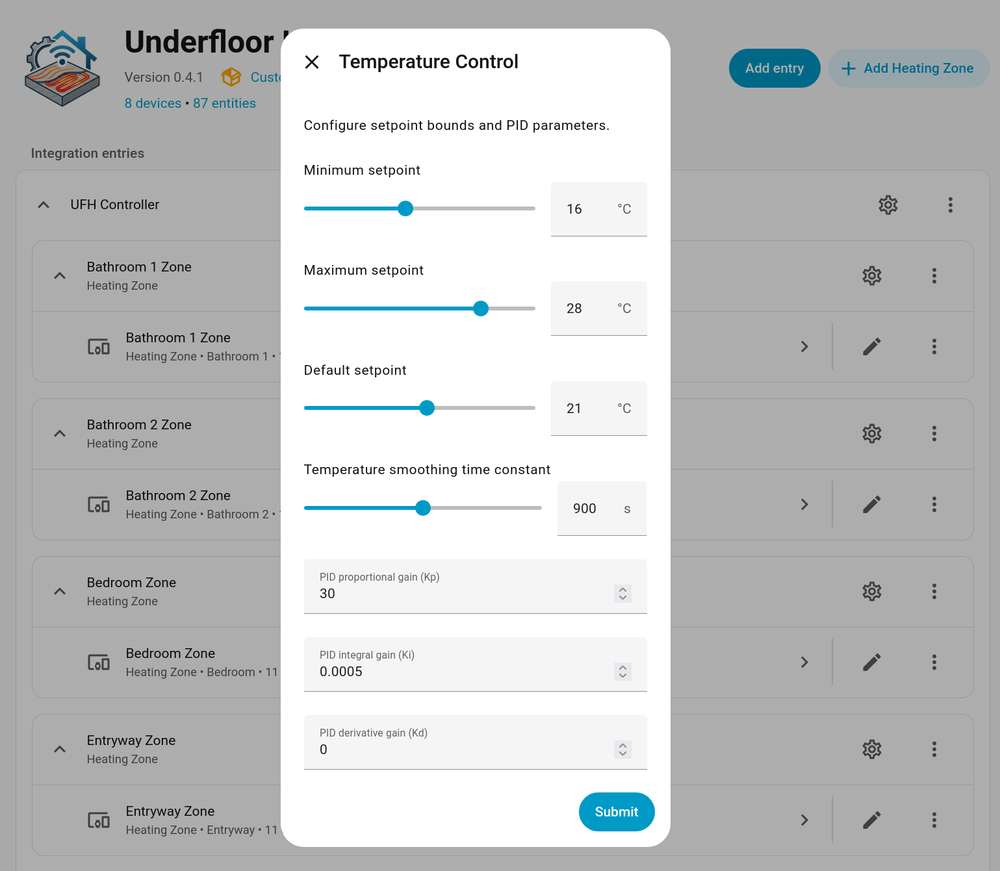
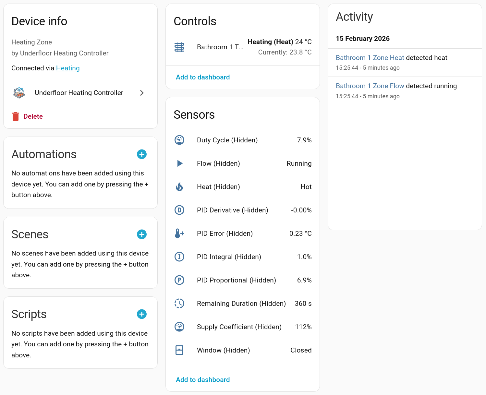
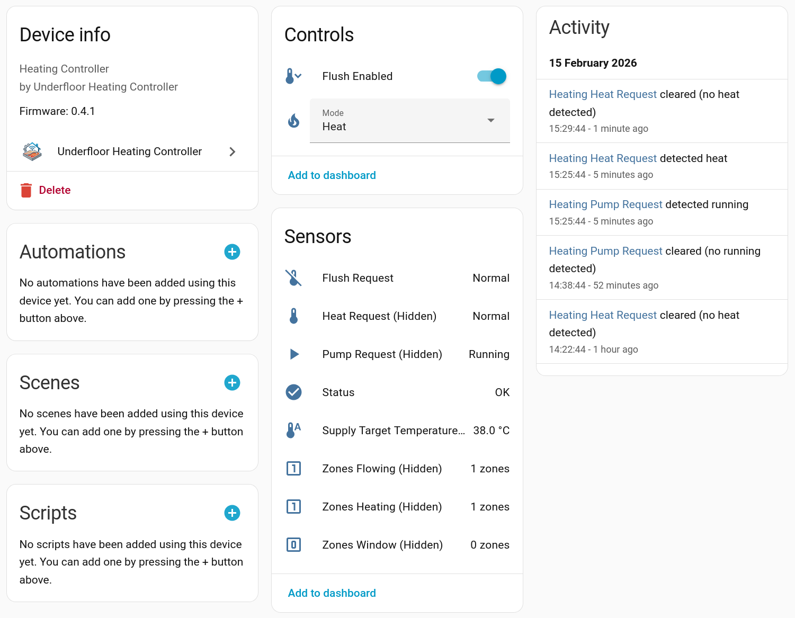

# Underfloor Heating Controller

**A Home Assistant integration purpose-built for hydronic underfloor heating systems. Fully open source, no gated features.**

While generic thermostats adapt radiator or TRV logic to UFH, this integration is purpose-built for UFH's unique characteristics: high thermal mass, slow response times, and the need to coordinate multiple zones sharing a single heat source.

## How It Compares

| | Generic Thermostats | This Integration |
|---|---|---|
| **Zone coordination** | Each zone fires the heat source independently | Zones aggregate demand into a single heat request with valve pre-opening |
| **Hot water priority** | Unaware of DHW or fights for priority | Blocks new heating during DHW, captures residual heat after |
| **Quota fairness** | Time-based or none | Supply-temperature-weighted — zones aren't penalized for cold-start periods |
| **UFH tuning** | Adapted from radiator/TRV logic | PID defaults, observation periods, and minimum run times designed for screed thermal mass |

## Is This For You?

This integration is designed for **hydronic underfloor heating** systems with any heat source — boilers, heat pumps, or district heating. It works with any heat source controllable via Home Assistant. Users with [EMS-ESP](https://github.com/emsesp/EMS-ESP32) (Bosch, Buderus, Nefit, Junkers, Worcester) get the deepest integration, but it's not a requirement.

**You need:**
- Temperature sensor per zone (Zigbee, Z-Wave, WiFi — anything HA supports)
- Controllable valve per zone (relay board, smart switch, etc.)
- Home Assistant 2025.10 or newer

**Optional hardware for advanced features:**
- Heat request switch or EMS-ESP for heat source coordination
- DHW active sensor for hot water priority and residual heat capture
- Outdoor temperature sensor for weather compensation
- Window/door sensors for automatic pause during ventilation
- Supply temperature sensor for heat accounting

The controller publishes a **supply target temperature** entity from its heating curve, which can drive external supply temperature control on heat pumps or mixing valves via automations.

## Setup in Minutes, No YAML Required

Everything is configured through the Home Assistant UI — no YAML editing, no manual reloads.

1. **Add the integration** from Settings > Devices & Services
2. **Walk through the setup wizard** — configure timing, PID parameters, and heat source settings with sensible defaults
3. **Add zones** as subentries — pick a temperature sensor, a valve switch, and optionally set presets
4. **Reconfigure anytime** through categorized options menus — no need to remove and re-add

See the [Quickstart Guide](docs/quickstart.md) for a detailed walkthrough.

## What You Get

### Per-Zone Climate Control with Presets

Each zone gets a full climate entity with five configurable presets: **Home** (21 °C), **Away** (16 °C), **Eco** (19 °C), **Comfort** (22 °C), and **Boost** (25 °C). All temperatures are defaults — adjust them per zone to match your home.

Presets work with Home Assistant automations — switch to "Away" when everyone leaves, "Comfort" in the evening, "Eco" overnight.

### Full Diagnostic Visibility

Unlike integrations that give you a single thermostat entity per zone, this controller exposes **11 entities per zone** so you can see exactly what's happening and troubleshoot without guessing:

**Per zone:** climate entity, duty cycle, remaining duration, PID error/proportional/integral/derivative, flow/heat/window binary sensors, and supply coefficient.

**Controller-level:** operation mode selector, zone counters (flowing/heating/window), heat request/pump request/flush request signals, controller status, and supply target temperature.

### PID Control Tuned for Underfloor Heating

Generic thermostats use bang-bang (on/off) or PID tuned for radiators. UFH needs different handling — concrete screed has high thermal mass, so overshoot is expensive and undershoot takes hours to recover from.

- **PID with anti-windup** — integral term clamps to prevent overshoot after long heating periods
- **Quota-based scheduling** — 2-hour observation periods allocate valve time based on duty cycle, preventing rapid cycling
- **Minimum run times** — valves won't open for less than 9 minutes (configurable), reducing actuator wear
- **EMA temperature smoothing** — filters noisy wireless sensor readings with configurable time constant

See [Control Algorithm](docs/control_algorithm.md) for the full technical details.

### Multi-Zone Heat Source Coordination

Multiple UFH zones sharing one heat source need coordination that per-zone thermostats can't provide:

- **Aggregated heat request** — zones coordinate demand into a single heat request signal instead of fighting each other
- **Valve pre-opening** — the controller waits for valves to physically open before requesting heat
- **Quota-aware requests** — stops requesting heat before a zone's time expires, so the heat source isn't fired for 30 seconds of remaining quota
- **Summer mode** — automatically disables the heating circuit when no zones need heat (EMS-ESP)
- **Supply target temperature** — heating curve output published as an entity, usable for driving heat pump or mixing valve setpoints

### Hot Water Priority

When someone takes a shower, generic thermostats either fight the heat source for priority or don't know DHW is happening. This controller:

- **Blocks new heating** during DHW — zones already flowing continue circulating, but new zones wait
- **Captures residual heat** — after DHW finishes, hot water still in the system gets circulated through floors instead of wasted
- **Configurable flush duration** — control how long post-DHW circulation runs

### Weather Compensation

Outdoor temperature compensation adjusts the supply target via a two-point heating curve:

- **Warmer outside = lower supply target** — reduces energy use automatically
- **Configurable curve points** — set warm/cold outdoor temperatures and their corresponding supply targets
- **Sensor fallback** — reverts to a fixed supply target if the outdoor sensor becomes unavailable

See [Heating Curve](docs/heating_curve.md) for details.

### Heat Accounting

Fair quota allocation across zones. Simply tracking valve-open time penalizes zones that happen to be open when the heat source is still warming up — they consume quota while receiving less heating benefit.

- **Supply-temperature normalization** — quota consumption adjusts to actual supply conditions
- **Single sensor** — only needs one manifold supply temperature sensor
- **Automatic fallback** — works with simple time-based tracking if no sensor is configured

See [Heat Accounting](docs/heat_accounting.md) for details.

### Zone Fault Isolation

A dead battery in one room's sensor shouldn't freeze the rest of your house:

- **Independent evaluation** — each zone fails and recovers on its own
- **4-state degradation** — INITIALIZING, NORMAL, DEGRADED (uses last-known demand for 1 hour), FAIL_SAFE
- **Safe initialization** — no valve actions until all zones have valid temperature readings (2-minute fast timeout)
- **Clear status reporting** — controller and zone health visible as entities with detailed attributes

See [Fault Isolation](docs/fault_isolation.md) for details.

## Operation Modes

| Mode | Purpose |
|------|---------|
| **Heat** | Normal PID control with quota-based zone scheduling |
| **Flush** | All valves open for circulation without heat request |
| **Cycle** | Diagnostic rotation through zones on 8-hour schedule |
| **All On** | All valves open with heating enabled |
| **All Off** | All valves closed, heating disabled |
| **Off** | Controller inactive, no actions taken |

See [Operation Modes](docs/operation_modes.md) for when to use each mode.

## Built for Reliability

This code controls heating for real homes. A bug can mean frozen pipes, burst plumbing, or wasted energy. The engineering reflects that:

- **~97% test coverage** with 100% line and branch coverage on all core control modules
- **14,000+ lines of tests** across unit, integration, scenario, and simulation suites
- **Physics-based simulations** verify PID convergence, disturbance rejection, and anti-windup behavior under realistic thermal conditions
- **State persistence** — all control variables survive HA restarts and crashes, with forward-compatible storage migration (V1 > V2 > V3)
- **Automated CI** — every PR runs tests, ruff linting (all rules), ruff formatting, ty type checking, hassfest, and HACS validation
- **Structured releases** — pre-release cycle (dev.1 > dev.2 > ... > stable) for each version

## Installation

### HACS (Recommended)

1. Open HACS in Home Assistant
2. Click the three dots menu > **Custom repositories**
3. Add `https://github.com/lnagel/hass-ufh-controller` with category **Integration**
4. Search for "Underfloor Heating Controller" and install
5. Restart Home Assistant

### Manual Installation

1. Download the latest release from [GitHub Releases](https://github.com/lnagel/hass-ufh-controller/releases)
2. Extract and copy `custom_components/ufh_controller` to your `config/custom_components` directory
3. Restart Home Assistant

## Documentation

- **[Quickstart Guide](docs/quickstart.md)** — Get up and running with your first zone
- **[Full Documentation Index](docs/index.md)** — All documentation in one place
- **[Configuration Reference](docs/configuration.md)** — Every parameter explained
- **[Control Algorithm](docs/control_algorithm.md)** — PID controller and scheduling logic
- **[Entities](docs/entities.md)** — All controller and zone entities
- **[Architecture](docs/architecture.md)** — Layered design and data flow
- **[Fault Isolation](docs/fault_isolation.md)** — Zone failure handling and recovery
- **[Heat Accounting](docs/heat_accounting.md)** — Supply-temperature-weighted quota allocation
- **[Heating Curve](docs/heating_curve.md)** — Outdoor temperature compensation
- **[Operation Modes](docs/operation_modes.md)** — When to use each mode
- **[Simulation Tests](docs/simulations.md)** — Physics-based validation of the control algorithm
- **[Tasmota Relay Configuration](docs/tasmota.md)** — Setting up Tasmota-controlled relay boards

## Contributing

See [CONTRIBUTING.md](CONTRIBUTING.md) for development setup, testing requirements, and contribution guidelines.

## License

MIT License — see [LICENSE](LICENSE) for details.
